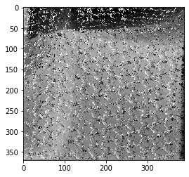

# Image-Stitching-Depth-Estimation

Co authored by: Irmak Turkoz https://github.com/IrmakTurkoz

Example algotihms for point matching, image stiching and disparity estimation. 

DisparityEstimation.ipybn estimates depth when provided with two different angels of an image. Background is represented in relatively darker colors. 

Several versions of pixel matching algorthms are implemented, each berforming better with certain images. 

an example result with cloth picture

